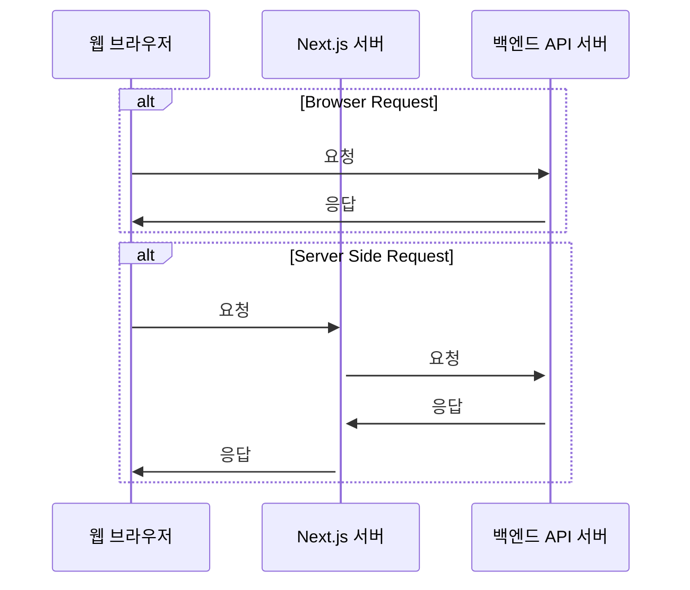

# 쿠키 헤더 테스트 전략

## 문제 개요
- 백엔드에서 설정한 쿠키가 프론트엔드에서 헤더에 제대로 포함되지 않는 경우 발생
- 주요 원인: 도메인 불일치, SameSite 설정, CORS 설정 등

## 테스트 환경 구성
- 프론트엔드: Next.js
- 백엔드: FastAPI
- 테스트 환경: 로컬호스트, 개발 서버(192.168.x.x), 운영 서버(도메인 + SSL)

## 테스트 시나리오 및 순서

### 로컬 개발 환경

- CORS 설정
- Browser Request 시 쿠키
- Server-side Request 시 쿠키

 